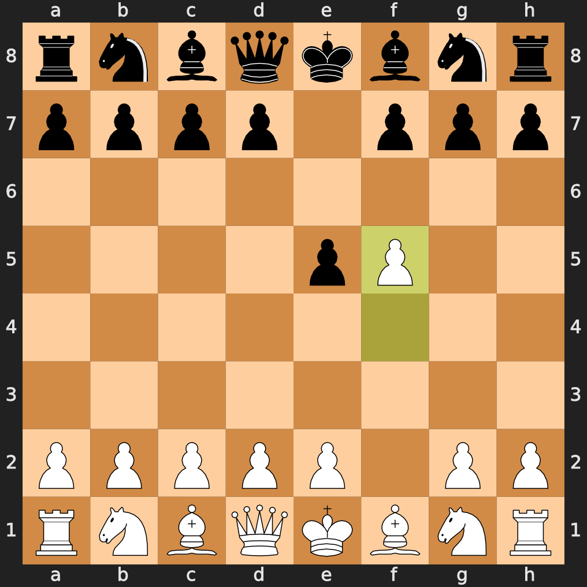

 <span style='text-align: center; color: purple;'>   Daunois Chess</span>
==============


This project was made in order to learn python with an amusing work subject. As an initiated in chess, antichess and atomic chess variants, I wanted to discovered how theses could be implemented as a game! The Game may not be as good as online chess websites are but I was a great opportunity to learn both chess engine and python.

## Content

This Game allow you to play in Chess and variants like : 

 - atomic
 - antichess
 - crazyhouse
 - kind of the hill
 - racing kings
 - One **mystery** (made by myself!) ~~with some bugs~~

## Run and play

Launch
    ```sh
        python3 ./main.py
    ```

Some libraries like pygame, chess, pygame-menu may needed to be installed. I had also tried to make an executable of the game in order to have all. Fell free to try the _lauch.py_ file, at your risks :)


## Remarks 

The game is not finished but the main program is working, fell free to use it ;)

## Notes

Look at this __**beautifully**__ made chessboard ! 

